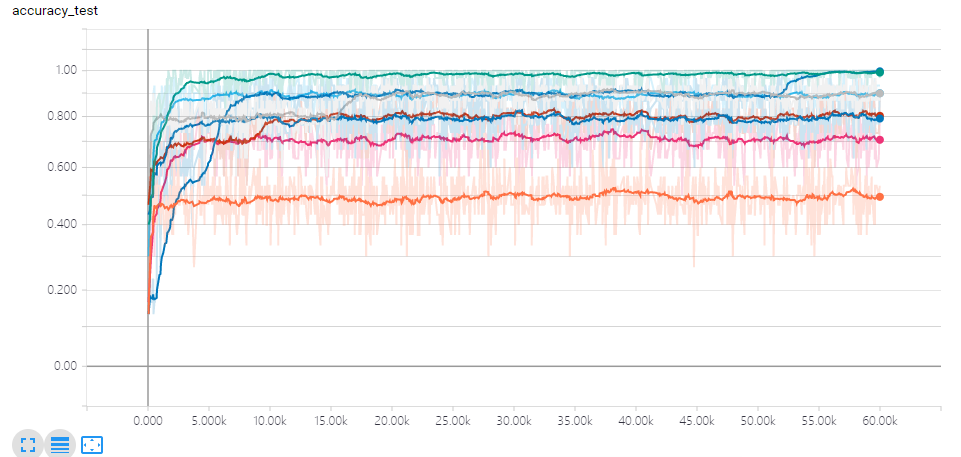

## 学习率、网络结构、参数初始化之间的相互影响关系
### Hyper parameter search 
#### Overview

#### 不同学习率

结论：
合适的学习率十分重要，影响模型性能的上限。

#### 不同网络结构不同参数初始化 

结论：
1. 合适的参数初始化十分重要，影响模型性能的上限。
2. 在合适的参数初始化下，网络结构也并非越复杂越好，而是要求“合理”（即卷积层和全连接层的数量的合理搭配）
3. 网络结构复杂会使学习过程变慢。

#### Top

结论：
1. 相同参数初始化和相同网络结构下，较大的学习率会加速学习过程。
2. 不同的参数初始化，合适的学习率是不同的。

#### 结论
学习率、网络结构、参数初始化三者之间需要合理搭配，才能使学习过程顺畅地进行，并最终提升性能。